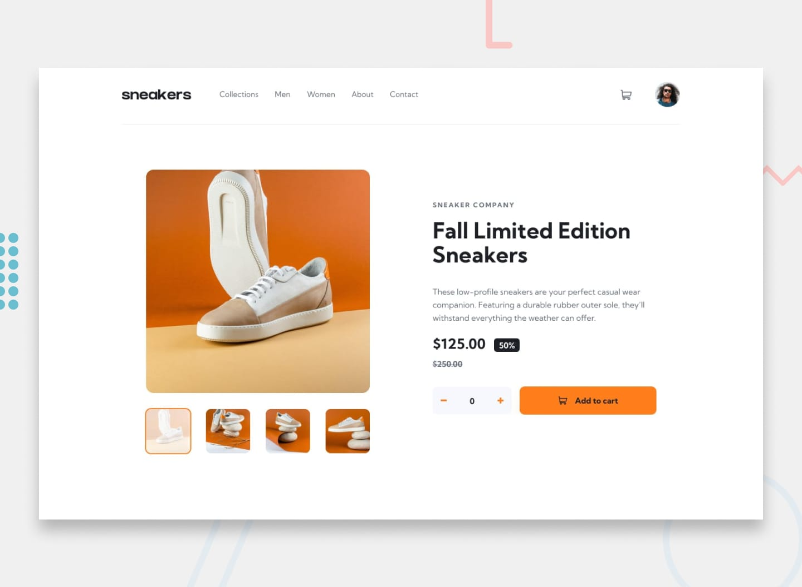

# Frontend Mentor - E-commerce product page

## Welcome! 👋

Thanks for checking out this front-end coding challenge.

[Frontend Mentor](https://www.frontendmentor.io) challenges help you improve your coding skills by building realistic projects.

**To do this challenge, you need a good understanding of HTML, CSS and JavaScript.**

## The challenge

Your challenge is to build out this e-commerce product page and get it looking as close to the design as possible.

You can use any tools you like to help you complete the challenge. So if you've got something you'd like to practice, feel free to give it a go.

Your users should be able to:

- View the optimal layout for the site depending on their device's screen size
- See hover states for all interactive elements on the page
- Open a lightbox gallery by clicking on the large product image
- Switch the large product image by clicking on the small thumbnail images
- Add items to the cart
- View the cart and remove items from it

### Want some support on the challenge? 

[Join our community](https://www.frontendmentor.io/community) and ask questions in the **#help** channel.

## Where to find everything

Your task is to build out the project to the designs inside the `/design` folder. You will find both a mobile and a desktop version of the design.

The designs are in JPG static format. Using JPGs will mean that you'll need to use your best judgment for styles such as `font-size`, `padding` and `margin`.

If you would like the Figma design file to gain experience using professional tools and build more accurate projects faster, you can [subscribe as a PRO member](https://www.frontendmentor.io/pro).

You will find all the required assets in the `/images` folder. The assets are already optimized.

There is also a `style-guide.md` file containing the information you'll need, such as color palette and fonts.

## Using AI coding assistants

We've included two files to help you if you're using AI coding assistants (like Claude, GitHub Copilot, Cursor, etc.) while working on this challenge:

- `AGENTS.md` - Contains detailed instructions for AI assistants on how to help you with this challenge. It's tailored to this challenge's difficulty level, so the AI will provide guidance appropriate to your learning stage—offering more support for beginner challenges and encouraging more independence on advanced ones.
- `CLAUDE.md` - A pointer file that directs Claude-based tools to the AGENTS.md instructions.

**How to use them:** You don't need to do anything! These files are automatically detected by most AI coding tools. The AI will read them and adjust its behavior to be a better learning partner—guiding you toward solutions rather than just giving you the answers.

**Note:** These files are designed to help you *learn*, not to do the work for you. The AI is instructed to ask questions, give hints, and explain concepts rather than writing complete solutions.

## Building your project

Feel free to use any workflow that you feel comfortable with. Below is a suggested process, but do not feel like you need to follow these steps:

1. Initialize your project as a public repository on [GitHub](https://github.com/). Creating a repo will make it easier to share your code with the community if you need help. If you're not sure how to do this, [have a read-through of this Try Git resource](https://try.github.io/).
2. Configure your repository to publish your code to a web address. This will also be useful if you need some help during a challenge as you can share the URL for your project with your repo URL. There are a number of ways to do this, and we provide some recommendations below.
3. Look through the designs to start planning out how you'll tackle the project. This step is crucial to help you think ahead for CSS classes to create reusable styles.
4. Before adding any styles, structure your content with HTML. Writing your HTML first can help focus your attention on creating well-structured content.
5. Write out the base styles for your project, including general content styles, such as `font-family` and `font-size`.
6. Start adding styles to the top of the page and work down. Only move on to the next section once you're happy you've completed the area you're working on.

## Deploying your project

As mentioned above, there are many ways to host your project for free. Our recommended hosts are:

- [GitHub Pages](https://pages.github.com/)
- [Vercel](https://vercel.com/)
- [Netlify](https://www.netlify.com/)

You can host your site using one of these solutions or any of our other trusted providers. [Read more about our recommended and trusted hosts](https://www.frontendmentor.io/guides/hosting-your-solution).

## Create a custom `README.md`

We strongly recommend overwriting this `README.md` with a custom one. We've provided a template inside the [`README-template.md`](./README-template.md) file in this starter code.

The template provides a guide for what to add. A custom `README` will help you explain your project and reflect on your learnings. Please feel free to edit our template as much as you like.

Once you've added your information to the template, delete this file and rename the `README-template.md` file to `README.md`. That will make it show up as your repository's README file.

## Submitting your solution

Submit your solution on the platform for the rest of the community to see. Follow our ["Complete guide to submitting solutions"](https://www.frontendmentor.io/guides/how-to-submit-solutions) for tips on how to do this.

Remember, if you're looking for feedback on your solution, be sure to ask questions when submitting it. The more specific and detailed you are with your questions, the higher the chance you'll get valuable feedback from the community.

## Sharing your solution

There are multiple places you can share your solution:

1. Share your solution page in the **#finished-projects** channel of the [community](https://www.frontendmentor.io/community). 
2. Share on [X (formerly Twitter)](https://x.com/frontendmentor) and mention **@frontendmentor**, including the repo and live URLs in your post. We'd love to take a look at what you've built and help share it around.
3. Share your solution on [LinkedIn](https://www.linkedin.com/company/frontend-mentor/).
4. Blog about your experience building your project. Writing about your workflow, technical choices, and talking through your code is a brilliant way to reinforce what you've learned. Great platforms to write on are [dev.to](https://dev.to/), [Hashnode](https://hashnode.com/), and [CodeNewbie](https://community.codenewbie.org/).

We provide templates to help you share your solution once you've submitted it on the platform. Please do edit them and include specific questions when you're looking for feedback. 

The more specific you are with your questions the more likely it is that another member of the community will give you feedback.

## Got feedback for us?

We love receiving feedback! We're always looking to improve our challenges and our platform. So if you have anything you'd like to mention, please email hi[at]frontendmentor[dot]io.

This challenge is completely free. Please share it with anyone who will find it useful for practice.

**Have fun building!** 🚀
INDIVIDUAL TEAM README:
NEXORA-2K26
# Design Mirror – UI/UX Design Challenge

**Department of Computer Science and Engineering**
**Hindusthan Institute of Technology**

---

## Event Details

| Details                | Information                            |
| ---------------------- | -------------------------------------- |
| **Event Name**         | Design Mirror – UI/UX Design Challenge |
| **Date**               | 16 September 2026                      |
| **Time**               | 10:00 AM – 12:30 PM                    |
| **Challenge Duration** | **1 Hour**                             |
| **Venue**              | CSE LAB II / 2nd Floor                 |
| **Team Size**          | Maximum 2 Members                      |

---

# Team Information

> **Participants must fill in this section after cloning the repository.**
# Team Information

> **Participants must fill in this section after cloning the repository.**

### College Name

`ADITHYA INSTITUTE OF TECHNOLOGY________________________________________`

### Team Name

`___TEAM PHOENIX_____________________________________`

### Team Members

**Member 1**

* Name: `SRI BALAJI M________________________________`

**Member 2**

* Name: `TANSEN D________________________________`

# About the Challenge

Design Mirror is a UI/UX design challenge where participants are given a problem statement and must design a suitable digital solution within the given time.

The challenge focuses on:

* Understanding the problem
* Identifying user needs
* UI design
* UX and usability
* User flow
* Creativity
* Ability to adapt to a surprise requirement

---

# Challenge Format

## Round 1 – Design

The problem statement will be revealed at the beginning of the challenge.

Participants must:

1. Understand the given problem.
2. Identify the target users and their needs.
3. Brainstorm a suitable solution.
4. Use the provided starter pack.
5. Design the UI/UX solution.
6. Focus on usability and user flow.

---

## Round 2 – Surprise Task

A surprise requirement will be announced **midway through the challenge**.

The surprise task will be related to the original problem.

Participants must:

1. Understand the new requirement.
2. Adapt their existing design.
3. Modify the solution to satisfy the new requirement.
4. Complete the changes within the remaining time.

### Important

**Do not completely restart your project after the surprise task.**

The ability to adapt your existing solution is part of the challenge.

---

# Final Submission

Before the 1-hour challenge deadline, your team must:

* Complete the UI/UX solution.
* Include the surprise-task requirement.
* Ensure the project is working/presentable.
* Keep the project ready for demonstration.
* Submit the completed project according to the instructions given by the organizers.

---

# Rules & Regulations

1. Maximum **2 members per team**.
2. Individual participation is **not allowed**.
3. The problem statement will be revealed at the start of the event.
4. The challenge duration is **1 hour**.
5. Participants must use the provided starter pack as instructed.
6. Participants must focus on UI, UX, usability and user flow.
7. The surprise task will be announced midway through the challenge.
8. The surprise task must be incorporated into the final solution.
9. Teams should **not completely restart** the project after the surprise task.
10. Do not copy another team's work.
11. All work must be completed within the given time.
12. The completed project must be ready for a brief demonstration.
13. Suitable design, development and AI tools may be used as permitted by the event guidelines.
14. The judges' decision will be final.

---

# Starter Pack

This repository contains the starter files required for the challenge.

### Participants should:

1. Clone this repository.
2. Open the project in their preferred development/design environment.
3. Fill in the **Team Information** section above.
4. Wait for the problem statement to be provided.
5. Start working using the provided starter files.
6. Implement the surprise requirement when announced.
7. Complete and prepare the project for final submission.

---
# Team Submission Checklist

Before submitting, make sure:

* [ ] Team information is filled in.
* [ ] Problem statement has been addressed.
* [ ] UI is complete.
* [ ] User flow is clear.
* [ ] Surprise task has been implemented.
* [ ] Project is ready for demonstration.
* [ ] No work has been copied from another team.
* [ ] Final project is submitted within the 1-hour deadline.

---

# Coordination Team

### Student Coordinator

**Muthuraman C K**
III Year / CSE
Email: [720824103104@hit.edu.in](mailto:720824103104@hit.edu.in)
Mobile: 8807773649

### Staff Coordinator

**B. Ramalakshmi**
Assistant Professor / CSE
Mobile: 9994617120

---

## Good Luck!

Understand the problem.
Design with purpose.
Adapt to the surprise.
Build a better experience.

**Design Mirror Team**
Department of Computer Science and Engineering
Hindusthan Institute of Technology
